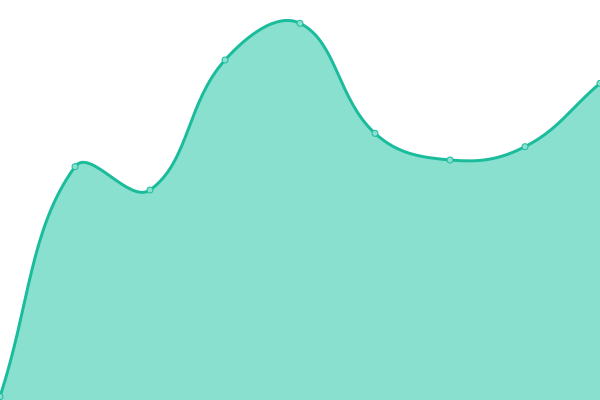

# [📈 Live Status](https://uvacoder.github.io/monitorme): <!--live status--> **🟧 Partial outage**

# [📈 Live Status](https://uvacoder.github.io/monitorme): <!--live status--> **🟧 Partial outage**

This repository contains the open-source uptime monitor and status page for [uvacoder](https://abclinks.vercel.app/), powered by [Upptime](https://github.com/upptime/upptime).

With [Upptime](https://upptime.js.org), you can get your own unlimited and free uptime monitor and status page, powered entirely by a GitHub repository. We use [Issues](https://github.com/uvacoder/monitorme/issues) as incident reports, [Actions](https://github.com/uvacoder/monitorme/actions) as uptime monitors, and [Pages](https://uvacoder.github.io/monitorme) for the status page.

<!--start: status pages-->
<!-- This summary is generated by Upptime (https://github.com/upptime/upptime) -->
<!-- Do not edit this manually, your changes will be overwritten -->
<!-- prettier-ignore -->
| URL | Status | History | Response Time | Uptime |
| --- | ------ | ------- | ------------- | ------ |
|  [MyLinks](https://abclinks.vercel.app) | 🟩 Up | [my-links.yml](https://github.com/Uvacoder/monitorme/commits/HEAD/history/my-links.yml) | 

 124ms
     
 | 

<a href="https://uvacoder.github.io/monitorme/history/my-links">100.00%</a>
    

|  [abcportfolio15](https://abcportfolio15.vercel.app) | 🟥 Down | [abcportfolio15.yml](https://github.com/Uvacoder/monitorme/commits/HEAD/history/abcportfolio15.yml) | 

 195ms
     
 | 

<a href="https://uvacoder.github.io/monitorme/history/abcportfolio15">0.00%</a>
    

|  [Hacker News](https://news.ycombinator.com) | 🟩 Up | [hacker-news.yml](https://github.com/Uvacoder/monitorme/commits/HEAD/history/hacker-news.yml) | 

 277ms
     
 | 

<a href="https://uvacoder.github.io/monitorme/history/hacker-news">100.00%</a>
    

<!--end: status pages-->

[**Visit our status website →**](https://uvacoder.github.io/monitorme)

## 📄 License

- Powered by: [Upptime](https://github.com/upptime/upptime)
- Code: [MIT](./LICENSE) © [uvacoder](https://abclinks.vercel.app/)
- Data in the `./history` directory: [Open Database License](https://opendatacommons.org/licenses/odbl/1-0/)
